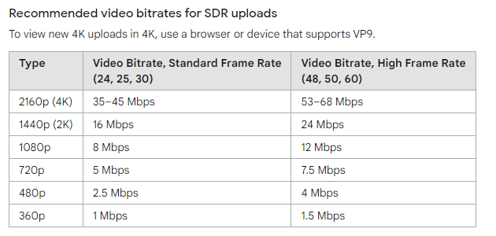
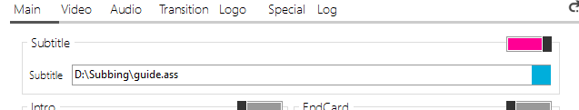
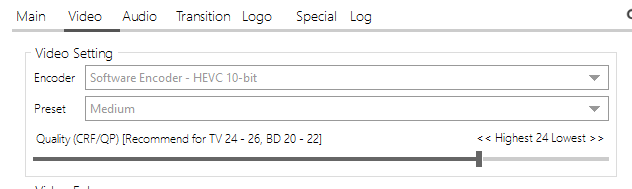
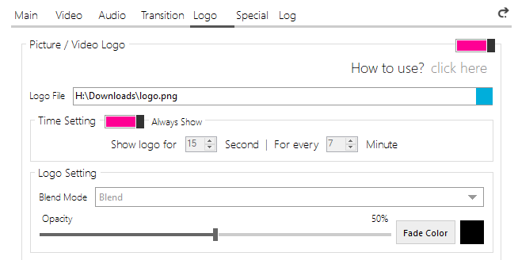
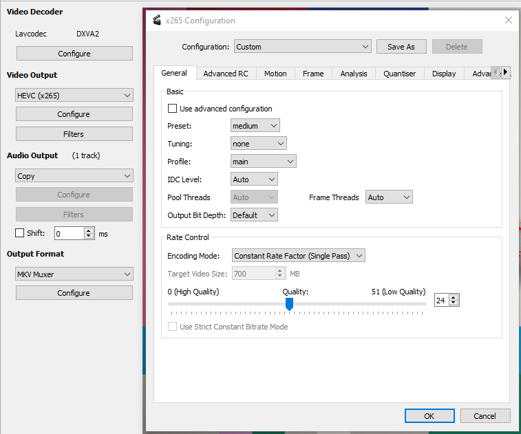
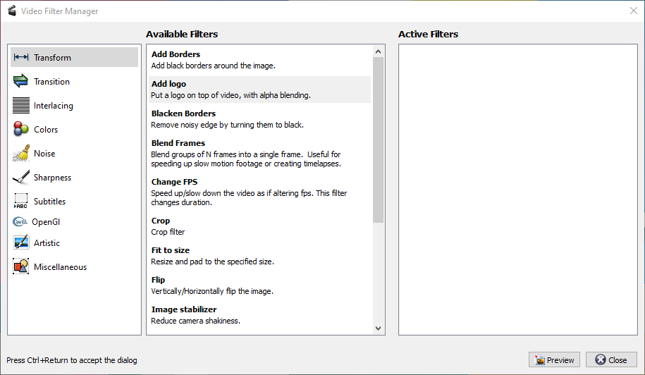
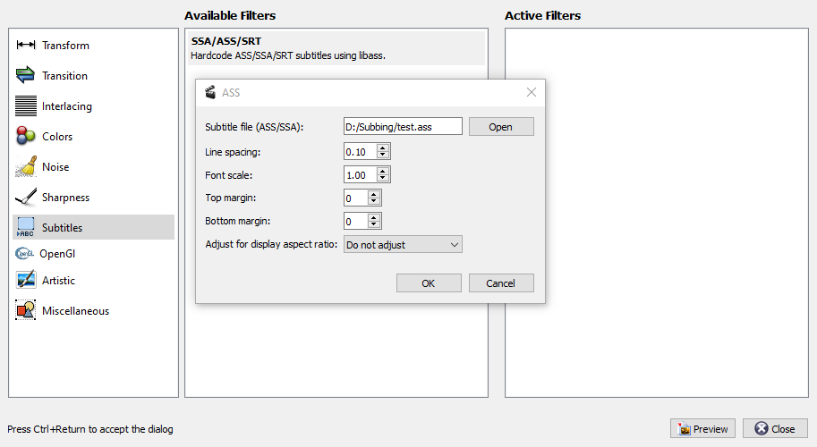

[• Home](./) [• Timing Guide](./timing-guide.html) [• Typesetting Guide](./typesetting-guide.html)

*Last update: 01.03.2022*

### Table of contents
1. [Overview](#overview)
2. [Programs](#programs)
  * [FFmpeg](#ffmpeg)
  * [Konayuki](#konayuki)
  * [Avidemux](#handbrake)

## Overview

In this encoding guide I will show how to burn subtitles on videos. For me, encoding is mainly balancing the following things:

Quality vs encoding time vs file size

Depending on what you value the most, your encoding settings will change. You will come across following settings across all encoding programs:

**Video encoder**

H.264 is the most used standard while H.265 (HEVC) is its successor which offers the same quality as H.264 while producing smaller files at the cost of the encoding time. It doesn't matter what you use but if you prefer smaller files and don't care much about the encoding time, then I can recommend H.265 to you.

You can also use your graphic cards for encoding instead of using your cpu for encoding. As of now though, to achieve the same quality as with cpu encoding, you have to choose a really high bitrate which also results in a really big file but it also encodes much faster which is really useful for streaming. But in our use case it's better to stick with cpu encoding.

**Quality**

You can either use CRF (constant rate factor) or bitrate for encoding. For CRF, small values result in good quality but big files while for bitrates it is big values. CRF is usually easier to use than bitrate as it automatically sets the bitrate for you.

*CRF*

CRF can range from 0 to 51. A good range for CRF is between 18 and 28. 23 is usually the standard value, so play around with it to see how it fits your needs.

*Bitrate*

For bitrate, choosing a good value can be a bit more complicated as it depends on what the target resolution is of your video (and often where you upload it to). For example these are the recommended bitrates for YouTube:



Often you can set something like an average bitrate or also a minimum and maximum bitrate. You can interpret is as the scope for how much motion or information a scene can have. If you have scenes for example with many people moving quickly (like soccer games) or noisy backgrounds (e.g. flashy signs) it is good to set a high (maximum) bitrate so that these scenes can be encoded well. If you have for example scenes where people just sit around, you can go with a lower bitrate.

[This video by Tom Scott visualizes well how bitrate works.](https://www.youtube.com/watch?v=r6Rp-uo6HmI)

**Preset**

Presets can range from *very slow* to *very fast*. *Very slow* increases your encoding time but results in much better quality than *very fast*. The standard is *medium* which you can start with. Adjust it depending on what you need.

These are the very basic settings which I usually adjust. Of course there are many more settings but for beginners these are enough.

## Programs

### FFmpeg

[Download](https://www.ffmpeg.org/download.html)

FFmpeg can be seen as the mother of all encoding programs as many encoding programs use FFmpeg internally. It doesn't come with a GUI, so you have to use it on your command line. For encoding, I usually use this command:

```
ffmpeg -i %INPUT% -i %LOGO% -filter_complex "[1]lut=a=val*0.3[a];[0][a]overlay=main_w-overlay_w-0:0[overlay]; [overlay]ass=%SUB%[out]" -c:v libx265 -crf 24 -map [out] -map 0:a -c:a copy -stats %OUTPUT1080%
```

This command adds a transparent logo and burns the subtitles in while copying the audio.

* **lut=a=val*0.3:** Make the logo transparent. As I added the logo as the second input, I can access with [1] (ffmpeg counts from 0).
* **overlay=main_w-overlay_w-0:0**: Put the logo over the video without adjusting its position.
* **ass=%SUB%:** Add subtitles
* **-c:v libx265:** Use H.265 for encoding. If you leave it out, ffmpeg will use H.264. Please note that H.265 will encode longer than H.264 but produces smaller files than H.264 with the same quality.
* **-crf 24:** 24 is a good compromise for me between file size and quality.
* **-stats:** Don't print out random stuff to the console.

As the default preset is medium and I'm fine with it, I didn't add it to the command.

### Konayuki

[Download](https://konayuki.moe/)

Add some subtitles:



Adjust your video settings (again, I like to use H.265/HEVC):



Add a logo with some opacity:



### Avidemux

[Download](http://avidemux.sourceforge.net/download.html)

Open the video and configure the video encoding to something you prefer (I use H.265/HEVC again):



Now you can click on `Video Output/Filters` to add a logo:



And add subtitles:



Start encoding then with `File > Save` or `File > Queue`.