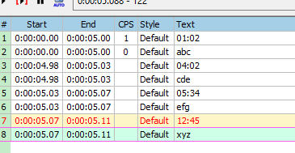
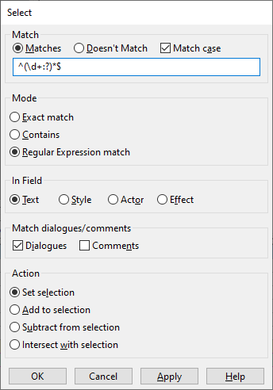
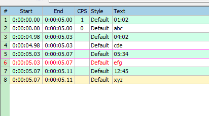

[• Home](./) [• Typesetting Guide](./typesetting-guide.html)

## Table of contents 
1. [Important buttons](#important-buttons)
2. [Frame-based timing](#frame-based-timing)
3. [Audio-based timing](#audio-based-timing)
4. [Delete all timestamps at once](#delete-all-timestamps-at-once)
4. [General tips](#general-tips)

---

## Important buttons

Keyboard arrow keys: 

⇦ ⇨

These buttons: 

1. Go to start of line (Default shortcut: CTRL + 1)
2. Go to end of line (Default shortcut: CTRL + 2)
3. **Set start time to current frame (Default shortcut: CTRL + 3)**
4. **Set end time to current frame (Default shortcut: CTRL + 4)**

Turn off the auto button:

[top](#table-of-contents)

---

## Frame-based timing

### With keys

I recommend to use the shortcuts for faster timing!

a) Click on a line you want to time

b) Go forward with ⇨ and backward with ⇦ on your keyboard to go to the desired video position

c) Set the start time of the line with button nr. 3 to that video position (use button nr. 4 to set the end time)

d) Go to the next line by pressing *ENTER* or *G*

You can quickly check with button nr. 1 and nr. 2 if you have timed your line correctly.

### Automatically by selecting the caption

If you use [this Aegisub version](https://github.com/wangqr/Aegisub/releases/), you can also use this button for timing a line:

A window opens where you can select the caption on screen and then the line is automatically timed.

**Be careful!** Using this function can be quite performance heavy! The longer the caption appears, the longer it takes (and Aegisub may crash or stop responding, oops). And the caption has to be static to time it correctly. So no movement, no fade, just a static caption.

[top](#table-of-contents)

---

## Audio-based timing

- Set the start time with a *left click*
- Set the end time with a *right click*
- Play the audio of your timed line by pressing *S*
- Play 500ms before your selection by pressing *Q* and 500ms after with *E* to check if your selection was correct
- Go to the next line by pressing *ENTER* or *G*

[top](#table-of-contents)

---

## Delete all timestamps at once

Imagine you have a bunch of timestamps like this but worse:

Deleting timestamps one by one can be a hassle, but there's regex to the rescue!

Go to *Subtitle* > *Select Lines...* and a window like this should open up:

Set everything similar to the screenshot above and then click on *OK*. Voilà, all lines with timestamps should get selected:

Now you can just hit *CTRL + DEL* and all timestamps are gone!

**But how did it work?**

As you can see, we set the mode to *Regular Expression match*, this basically means that we asked for all lines which match our pattern in the text field. Our pattern for timestamps is `^(\d+:?)*$`. To break it down into its components:

- `^`: Match every line which starts with the following pattern

- `\d+`: Match all numbers
- `:?`:  Match the `:` symbol zero or one time
- `*`: Match it zero ore more times

So `(\d+:?))\*` means that we want to get all numbers with zero or one `:` symbol appended multiple times.

- `$`: Match every line ending with the previous pattern

If your timestamps use `.` instead of `:` (e.g. `01.55.55`, exchange the `:` in the pattern with `\.` We need the backslash because `.` on its own has a special meaning in regular expressions. [Regex101](https://regex101.com/) is a good website to test out if your regular expression works and how.

[top](#table-of-contents)

---

## General tips

- You can quickly skip through a video with *SHIFT + ⇦ / ⇨*
- You can quickly adjust the timing of two following lines without gaps by selecting them, doing a *right click* and then choose one of those:

- If you have many lines to time in your document with the translation, you can copy them all at once and paste them into the line grid

[top](#table-of-contents)