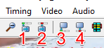
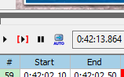
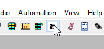
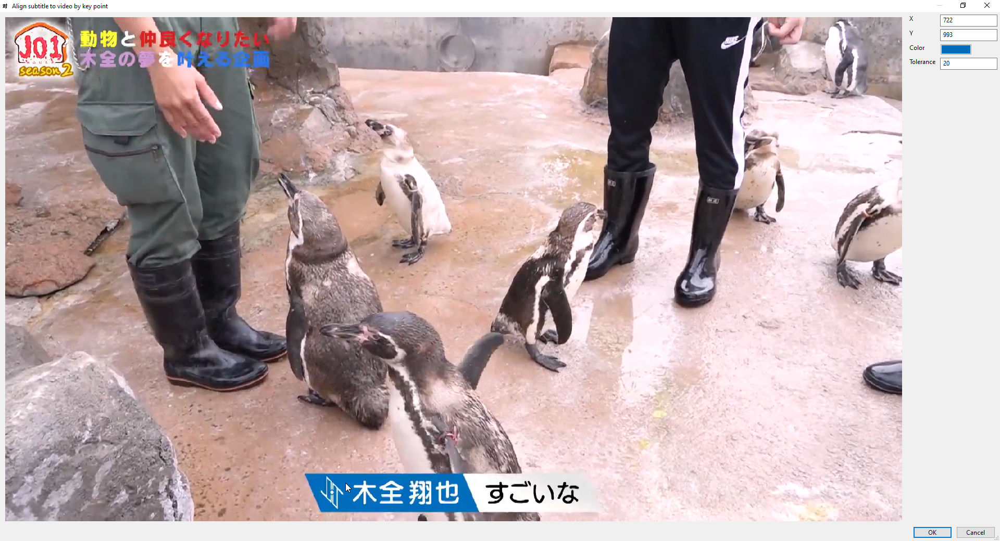
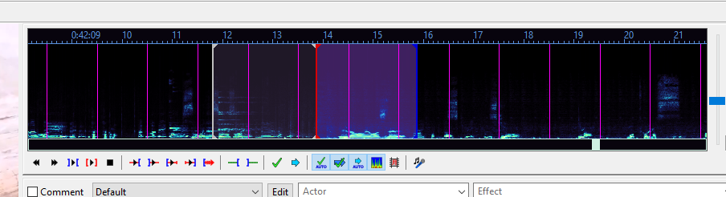
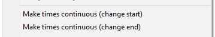

[• Home](./) [• Typesetting Guide](./typesetting-guide.html)

## Table of contents 
1. [Important buttons](#important-buttons)
2. [Frame-based timing](#frame-based-timing)
3. [Audio-based timing](#audio-based-timing)
4. [General tips](#general-tips)

---

## Important buttons

Keyboard arrow keys: 

⇦ ⇨

These buttons: 

1. Go to start of line (Default shortcut: CTRL + 1)
2. Go to end of line (Default shortcut: CTRL + 2)
3. **Set start time to current frame (Default shortcut: CTRL + 3)**
4. **Set end time to current frame (Default shortcut: CTRL + 4)**

Turn off the auto button:

[top](#table-of-contents)

---

## Frame-based timing

### With keys

I recommend to use the shortcuts for faster timing!

a) Click on a line you want to time

b) Go forward with ⇨ and backward with ⇦ on your keyboard to go to the desired video position

c) Set the start time of the line with button nr. 3 to that video position (use button nr. 4 to set the end time)

d) Go to the next line by pressing *ENTER* or *G*

You can quickly check with button nr. 1 and nr. 2 if you have timed your line correctly.

### Automatically by selecting the caption

If you use [this Aegisub version](https://github.com/wangqr/Aegisub/releases/), you can also use this button for timing a line:

A window opens where you can select the caption on screen and then the line is automatically timed.

**Be careful!** Using this function can be quite performance heavy! The longer the caption appears, the longer it takes (and Aegisub may crash or stop responding, oops). And the caption has to be static to time it correctly. So no movement, no fade, just a static caption.

[top](#table-of-contents)

---

## Audio-based timing

- Set the start time with a *left click*
- Set the end time with a *right click*
- Play the audio of your timed line by pressing *S*
- Play 500ms before your selection by pressing *Q* and 500ms after with *E*
- Go to the next line by pressing *ENTER* or *G*

[top](#table-of-contents)

--- 

## General tips

- You can quickly skip through a video with *SHIFT + ⇦ / ⇨*
- You can quickly adjust the timing of two following lines without gaps by selecting them, doing a *right click* and then choose one of those:

- If you have many lines, you can copy them all at once and paste them into the line grid

[top](#table-of-contents)