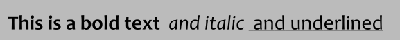
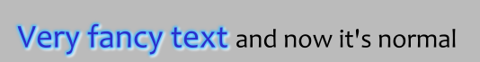
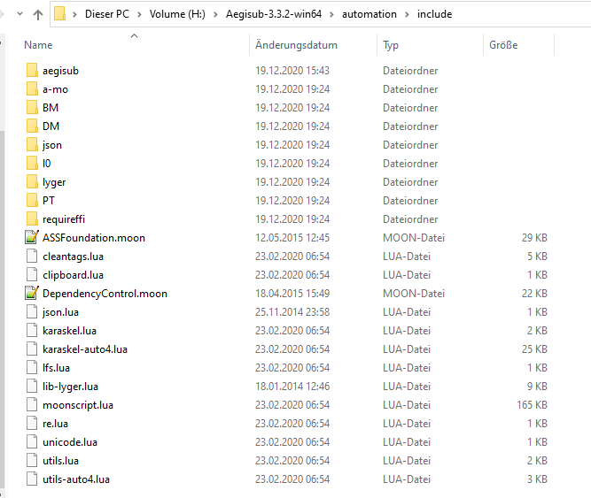
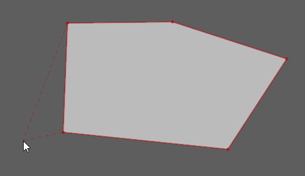
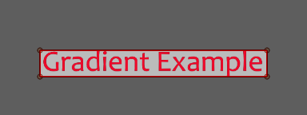

[• Home](./) [• Timing Guide](./timing-guide.html)

*Last update 26.03.2021*

You want to learn how to typeset?

I've compiled some tips and tricks to typesetting with code and visual examples. There are 6 main sections:

**Useful sites** Links which will help you to get started or if you want to find deeper information

**Introduction to basic Aegisub features** Helps you with navigating through the program

**Basic tags** Most common tags for manipulating text. There are more but I just cover the ones I usually use

**Shapes and clippings** How to draw boxes, circles and more

**Transformations** This involves the `\t`tag and lets you animate stuff, such as a text changing from blue to red or changing its size

**Recommend scripts** Scripts to make your typesetter life easier

[Here](https://github.com/Miayl/jekyll-page/blob/gh-pages/aegifiles/guide.ass) is an aegisub files with most examples which were covered in this guide.

## Table of contents

1. [Useful sites](#useful-sites)
2. [Introduction to basic Aegisub features](#introduction-to-basic-aegisub-features)
2. [Basic tags](#basic-tags)
3. [Shapes and clippings](#shapes-and-clippings)
4. [Transformations](#transformations)
5. [Recommended scripts](#recommended-scripts)

## Useful sites

[Official Aegisub](https://github.com/Aegisub/Aegisub/releases)
You will need this for typesetting.

[Aegisub fork](https://github.com/wangqr/Aegisub/releases)
The development of the original Aegisub stopped in 2014 (apart from some developer releases here and there). In this fork, Aegisub was further developed with some new functions.

[Aegisub tags](http://docs.aegisub.org/3.2/ASS_Tags/)
Official documentation for all available tags in Aegisub, e.g. \fad, \t

[Typesetting guide](https://unanimated.github.io/ts/index.htm)
Focused on typesetting for anime, also with some really useful scripts

[top](#table-of-contents)

---

## Introduction to basic Aegisub features

Let's introduce you to the most important features of Aegisub which you will need as a typesetter.

- [Overview](#overview)
- Styles Manager
- Selecting Lines
- [Auto save](#auto-save)

### Overview

So it's your first time installing and opening Aegisub. What now? There are a lot of buttons!

**The video area**


1. Contains a style manager for setting styles and selecting multiple lines at once. A style is a definition or preset of how a line or text should look like
2. Here you can automatically open a video. It also automatically opens its audio. Sometimes you are asked if you want to set the script resolution to the video resolution. Usually that's a good idea
3. Here are some visual typesetting tools like moving lines or rotating them
4. Your video and preview of your lines
5. Play or pause video. Second play button only plays the line. The auto button automatically moves the video to the beginning of your selected line. I would recommend to turn off this function
6. Your current video position in time (in the screenshot 0:00:30.989) and frame (in the screenshot 743)
7. The + number tells you in ms how far you are away from the line beginning and the - number how far you are way from the line ending

You can hover over video and use your scroll wheel for zooming in and out the video.

**The audio and text box area**


1. Audio spectrum of your video
2. First two bars are for scaling the audio spectrum. Last bar is the audio volume. Click on the green box to activate the last bar
3. Comment or uncomment your line
4. Use a different style for this line which is listed in the Styles Manager
5. Which layer your line is on. Imagine you have two lines which overlap. You can move a line into the foreground my giving it a higher layer number than the other one
6. Three time boxes: Start time, end time & duration
7. Different rich text options: Bold, italic, underline, strikeout, fonts
8. Four AB boxes for setting different colors: Primary, secondary (for karaoke), border and shadow color
9. Compare your changes with a version before the changes
10. Text box

**The subtitle grid area**


1. This is where all your lines are
2. Line number
3. As the header says, start and end time, etc. CPS = characters per second
4. lines which timings overlap are marked red
5. The greenish line is your currently selected line
6. Purplish line is a commented line
7. Yellow line is where your current video is

Of course you can select different line colors in the Aegisub settings!

The ☀ (sun) symbol in a line means that this line contains tags. If you want to see all tags, you can select *View > Show Tags* instead of *Simplify Tags*.


Now your subtitle grid should look like this:


### Auto save

Basically the first Aegisub setting you want to activate is this one:


Every time you make a change, your file gets saved.

[Introduction to basic Aegisub features](#introduction-to-basic-aegisub-features) | [top](#table-of-contents)

---

## Basic tags

All tags are defined within curly brackets, for example `{\fn80}`. You can define multiple tags within a single pair of curly brackets, e.g. `{\fn80\pos(10,20)\blur1}`.

- [Colors](#colors)
- [Border, shadow, bold, italic, fonts](#border-shadow-bold-italic-fonts)
- [Size](#size)
- [Position](#position)
- [Blur](#blur)
- [Line breaks and spacing](#line-breaks-and-spacing)
- [Fade in and out](#fade-in-and-out)
- [Opacity](#opacity)
- [Rotation](#rotation)
- [Clipping](#clipping)
- [Movement](#movement)
- [Reset everything](#reset-everything)

[top](#table-of-contents)

### Colors


`{\c&H000000&}This is {\c&H260EC8&}a text`

You can change the color of the text with following tags:

- \c - Main color
- \3c - Border color
- \4c - Shadow color

Or these buttons:


A window opens where you can select a color (use the pipette symbol to pick a color from the video):


⚠️ Tip: Quickly change to white in the editor by typing *\c* (but doesn't work in combination wit the `\t` tag)

[Basic tags](#basic-tags)

### Border, shadow, bold, italic, fonts

#### Border


`{\bord4}This is a text`

There's also `\xbord`and `\ybord` for further manipulation.

#### Shadow


`{\shad4}This is a text`

There's also `\xshad`and `\yshad` for further manipulation.

#### Bold, italic, underlined



`{\b1}This is a bold text {\b0\i1} and italic {\i0\u1} and underlined`

#### Font


`This was Candara {\fnArial} and now it's Arial`

[Basic tags](#basic-tags)

### Size

#### \fn


`{\fs30}Small text {\fs100}big text`

#### \fscx, \fscy


`{\fscx150}Wide text {\fscy200}Tall text`

Or this button for `\fscx` `\fscy`:


100 is the default size for `\fscx` `\fscy`

[Basic tags](#basic-tags)

### Position

#### \pos

`{\pos(412.322,286)}This is a text`

Or this button:


A little box appears next to the text which you can drag to change its position:


#### \an

You can also anchor the text to different video positions by using `\an` and the numbers 1 - 9:


[Basic tags](#basic-tags)

### Blur


`{\shad4\bord4}normal {\blur10}everything {\blur0\be10}or just the edges`

[Basic tags](#basic-tags)

### Line breaks and spacing


`I break\Nthis\h\h\h\hwith spaces {\fsp10}and wider`

- `\N` Line break, in the editor press *SHIFT + ENTER* to add a line break at cursor position
- `\h` Hard space, very useful in combination with `\an` and `\N` to avoid splitting a line in two
- `\fsp` Space between letters, default is 1
- `\q` Mode for line wrapping, `\q2` is no automatic line wrapping

[Basic tags](#basic-tags)

### Fade in and out

`{\fad(300,300)} This text fades in for 300ms and out for 300ms`

First number is fade-in time, second one is fade-out time

**Q. How to I get precise fade times?**

Below the video player there are these numbers:


Select your line and jump with the video to the frame where the caption is fully seen. The + number (left) is your fade-in time. For fade out, jump to one frame before the caption starts to fade out. The - number (right) is your fade-out time.

[Basic tags](#basic-tags)

### Opacity


```
Full {\alphaH&80&}half {\alphaH&FF&}invisible
```

`\alpha` uses hexadecimal numbers to specify the opacity. It ranges from H&00& (fully visible) to H&FF& (invisible).

- `\a1` Primary text opacity
- `\a3` Border opacity
- `\a4` Shadow opacity

[Basic tags](#basic-tags)

### Rotation

#### \frz


`{\frz45}Rotated by 45 degrees`

With `\frz` you can rotate a line by * degrees. You can also use negative numbers.

#### \frx, \fry


`{\frx6\fry308}Rotated with \frx and \fry`

With `\frx` and `\fry` you can do 3d-like transformations.

You can also rotate with this button (`\frz`) and the button (`\frx` `\fry`) below:


[Basic tags](#basic-tags)

### Clipping

#### Rectangle clips


`{\clip(354.054,188.444,480.375,302.222)}Clipping example`

Format: 

`\clip(x_start, y_start, x_end, y_end)`

Or this button at the left:


With `\clip` you can set a zone where your line can be seen. If you use `\iclip`, you do the reverse: a zone where the line *can't* be seen.

#### Vectorial clips


`{\clip(m 361 160 l 290 376 387 328 515 170 361 190 565 261 585 232)}Clipping example`

Using this button:


Allows you to draw non-rectangle clips. Please note that only rectangle clips can be combined with the transformation tag `\t`.

[Basic tags](#basic-tags)

### Movement

`{\move(285,164,573,174,50,709)}This line moves from left to right`

Syntax: `\move(x1,y1,x2,y2,start,end)`

Using the example from above, the line moves from (285,164) starting from 50ms to (573,174) until 709ms. You can also leave out start and end time (`\move(x1,y1,x2,y2)`). The line will move then the entire duration. You can also use this button:


The square sets the start position while the circle sets the end position:


[Basic tags](#basic-tags)

### Reset everything



`{\c&HCD302A&\fs60\shad2\bord2\blur2}Very fancy text {\r}and now it's normal`

`\r` resets everything to the default settings of the style or even change to a different style in a line. For example if you have a style named `Another Style`, you can change to it by writing `\rAnother Style`. Please note that this still resets every previous tags.

[Basic tags](#basic-tags) | [top](#table-of-contents)

---

## Shapes and clippings

* [Simple shapes](#simple-shades)
* [Box with text](#box-with-text)


### Simple shapes

The `\p1` tag marks drawings like these:


Square: 

```
{\an5\bord0\shad0\blur1\pos(640,360)\p1}m 0 0 l 100 0 100 100 0 100
```

Circle:
```
{\an7\bord0\shad0\blur1\p1\pos(293.062,329.778)}m -100 -100 b -45 -155 45 -155 100 -100 b 155 -45 155 45 100 100 b 46 155 -45 155 -100 100 b -155 45 -155 -45 -100 -100
```

Triangle:
```
{\an7\bord0\shad0\blur1\p1\pos(590.183,178.667)}m -122 70 l 122 70 l 0 -141
```

With this button:


An editor opens where you can draw some shapes which gives you the code for inserting it into Aegisub.

### Box with text

Now  that we know how to make simple shapes, we can make something like text boxes since every shape can be manipulated with any tags.


```
Dialogue: 0,0:00:13.00,0:00:15.00,Default,,0,0,0,,{\bord0\shad0\blur1\p1\fscx500\pos(451.408,345.778)}m 0 0 l 100 0 100 100 0 100
Dialogue: 0,0:00:13.00,0:00:15.00,Default,,0,0,0,,{\c&HFFFFFF&\pos(451.908,344.889)}I have text
```

You can also make a box of abitrary size and just use `\clip` to adjust the size of the box. This works the best for boxes which don't need to move.

[Shapes and clippings](#shapes-and-clippings) | [top](#table-of-contents)

---

## Transformations

* [Growing / shrinking](#growing-shrinking)
* [Changing colors](#changing-colors)
* [Appearing from left right / right to left](#appearing-from-left-to-right-right-to-left)

The `\t` tag allows us to add all kind of animations to our lines. The most common syntax are:

- `\t(tags)` applies the given tags for the entire duration of the line. For example `\fs50\t(\fs80\blur10)` would gradually increase the font size from 50 to 80 and make the text blurry.
- `\t(start,end,tags)` With this, you can decide when a transformation should start and when it should end (for example a blinking text). `\shad0\t(500,end,\shad4)` makes the shadow stronger starting from 500ms until the end of the line, while with `\shad0\t(500,800,\shad4)` the shadow growth would stop at 800ms.

To get the correct start and end times, select your line and move to the video position where the effect should start or stop.


Use the number with the + mark (in this image 250ms).

### Growing / shrinking


```
{\fs20\t(19,1000,\fs80)}Hello, I grow
```
To make the text shrink, just reverse the `\fs` tags:


```
{\q2\fs200\t(19,1000,\fs20)}Hello, I shrink
```

I added the `\q2` tag so that Aegisub doesn't add line breaks when the text doesn't fit into the box. See the difference without the `\q2` tag:


[Transformations](#transformations)

### Changing colors


```
{\t(start,1000,\cH&00FFFF&)}From black to yellow
```


```
{\cH&FFFFFF&\t(100,100,\c&H0000FF&)\t(300,300,\c&HFFFFFF&)\t(600,600,\c&H0000FF&)\t(900,900,\c&HFFFFFF&)\t(1200,1200,\c&0000FF&)}I blink a lot
```

[Transformations](#transformations)

### Appearing from left to right / right to left


(Sorry for the lag towards the end)

```
{\clip(118.493,196.267,149.45,291.2)\t(\clip(118.493,196.267,749.45,291.2)}I suddenly appear and spook you
```

[Transformations](#transformations)

### Unblur


```
{\blur20\t(\blur0)}Suddenly gaining vision
```

To make a text blurry, reverse the `\blur` tags.

[Transformations](#transformations) | [top](#table-of-contents)

---

## Recommended scripts

Instead of putting all of your sweat and blood into typesetting the most complex effects, why not using some scripts which can make your life easier? In this section I will introduce some scripts which I like to use and which can speed up your typesetting.

- [How to add scripts](#how-to-add-scripts)
- [HYDRA](#hydra-by-unanimated)
- [Masquerade](#masquerade-by-unanimated)
- [Hyperdimensional Relocator](#hyperdimensional-relocator-by-unanimated)
- [GradientEverything](#gradienteverything-by-lyger)
- [Aegisub-Motion](#aegisub-motion)

### How to add scripts

You have to put all scripts into the `automation/autoload` folder where you installed Aegisub.

For some scripts, you might need to add [DependencyControl](https://github.com/TypesettingTools/DependencyControl) and all its requirements to be able to use the scripts. Those required scripts have to be put into the `automation/include` folder. Example:



### HYDRA by unanimated

If you are still unfamiliar with tags or want to set tags for multiple lines at once, you can use this script to easily add tags to lines. There are three different views: The basic one, medium and full. In most cases, the basic or the medium view should be enough.


It also adds an useful non-gui macro to the automation menu for commenting lines via hotkeys:


[Download](https://github.com/unanimated/luaegisub/blob/master/ua.HYDRA.lua) | [Manual](https://unanimated.github.io/ts/scripts-manuals.htm#hydra)

### Masquerade by unanimated

While this one has many more functions, I mainly use this one in combination with `\clip` and the `Mask: from clip` option to get shapes.

First I draw a shape with `\clip`:



Then I set Mask to `from clip` and click on the Masquerade button.


Voilà:


And the code which was generated:

```
{\an7\blur1\bord0\shad0\fscx100\fscy100\pos(0,0)\p1}m 175 119 l 359 117 560 182 456 341 167 311
```

[Download](https://github.com/unanimated/luaegisub/blob/master/ua.Masquerade.lua) | [Manual](https://unanimated.github.io/ts/scripts-manuals.htm#masquerade)

### Hyperdimensional Relocator by unanimated

Actually I only use this one for the following macros it adds for re-positioning lines:


Though some of the other functions can be quite useful too.

[Download](https://github.com/unanimated/luaegisub/blob/master/ua.Relocator.lua) | [Manual](https://unanimated.github.io/ts/scripts-manuals.htm#relocator)

### GradientEverything by lyger

This one is great for adding all kinds of gradients. A basic use could be a line which starts black and then fades to red. First, you add a black and a red line:

```
Dialogue: 0,0:00:17.00,0:00:19.00,Default,,0,0,0,,{\pos(427,241.067)}Gradient Example
Dialogue: 0,0:00:17.00,0:00:19.00,Default,,0,0,0,,{\c&H2908F0&\pos(427,241.067)}Gradient Example
```

Then, you add a clip box to one of the lines:



Now select all lines which should be used for the gradient and open GradientEverything. I just want to gradient the main color, so I check the `\c` box and choose *horizontal* (there's also vertical) before pressing *OK*. With * Pixels per strip* you can adjust how granularity of the gradient.


This is the result:


Make sure to move your text to the right position first before adding a gradient to it.

[Download](https://github.com/TypesettingTools/lyger-Aegisub-Scripts/blob/master/macros/lyger.GradientEverything.moon) | (Needs [DependencyControl](https://github.com/TypesettingTools/DependencyControl) and [LibLyger](https://github.com/TypesettingTools/lyger-Aegisub-Scripts/blob/master/modules/LibLyger.moon))

### Aegisub-Motion

No matter how much you try to adjust `\move`, some captions move in a non-constant way, making it really difficult to capture the caption's movement in one line. So to be able to move your lines as beautiful as the original captions, you use motion tracking software like Mocha Pro or Blender which support After Effect keyframe data which can be applied to your lines. I won't cover how to use motion tracking software.

First, you need to download x264 or [ffmpeg](https://ffmpeg.org/download.html) and add its path to the trim settings:


I would recommend to use x264. Ffmpeg needs a custom encoding command (which I tried to google and didn't work) and is slower.

Then basically you select the line(s) you want to add motion tracking to and use `Aegisub-Motion/Trim` which exports the video cut to the length of your line. You can load this snippet into your motion tracking software of choice, track your line and copy the resulting After Effect keyframe data.

Back to Aegisub and with your line(s) still selected, you use `Aegisub-Motion/Apply`, paste your data into the box and then check all tags the motion data should be applied to before pressing *Go*.


This will spill out a lot of lines, usually one for each frame.


[Download](https://github.com/TypesettingTools/Aegisub-Motion) | (Needs [DependencyControl](https://github.com/TypesettingTools/DependencyControl))

[top](#table-of-contents)