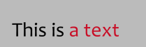

[• back](./) [• Timing guide](./timing-guide.html)

## Table of contents 

1. [Useful sites](#useful-sites)
2. [Level 1: Basic tags](#level-1-basic-tags)
3. [Level 2: Transformations](#level-2-transformations)
4. [Recommended scripts](#recommended-scripts)

## Useful sites

[Aegisub tags](http://docs.aegisub.org/3.2/ASS_Tags/)
Official documentation for all available tags in Aegisub, e.g. \fad, \t

[Typesetting guide](https://unanimated.github.io/ts/index.htm)
Focused on typesetting for anime, also with some really useful scripts

[top](#table-of-contents)

---

## Level 1: Basic tags

[top](#table-of-contents)

### Colors

`{\c&H000000&}This is {\c&H260EC8&}a text`

You can change the color of the text with following tags:

- \c - Main color
- \3c - Border color
- \4c - Shadow color

Or these buttons:

A window opens where you can select a color (use the pipette symbol to pick a color from the video):

Tip: Quickly change to white in the editor by typing *\c*

[Level 1: Basic tags](#level-1-basic-tags)

### Text (border, shadow, bold, italic, fonts)

#### Border

`{\bord4}This is a text`

[Level 1: Basic tags](#level-1-basic-tags)

### Size

[Level 1: Basic tags](#level-1-basic-tags)

### Position

[Level 1: Basic tags](#level-1-basic-tags)

### Blur

[Level 1: Basic tags](#level-1-basic-tags)

### Line breaks & spaces

[Level 1: Basic tags](#level-1-basic-tags)

### Fade in & out

[Level 1: Basic tags](#level-1-basic-tags)

### Opacity

[Level 1: Basic tags](#level-1-basic-tags)

### Clipping

[Level 1: Basic tags](#level-1-basic-tags)

### Movement

[Level 1: Basic tags](#level-1-basic-tags)

---

## Level 2: Transformations

[top](#table-of-contents)

### Text grows / shrinks

[Level 2: Transformations](#level-2-transformations)

### Text changes color

[Level 2: Transformations](#level-2-transformations)

### Text appears from left to right / right to left

[Level 2: Transformations](#level-2-transformations)

### Box with text

[Level 2: Transformations](#level-2-transformations)

---

## Recommended scripts

[top](#table-of-contents)