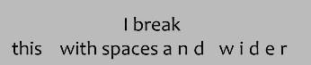

[• Home](./) [• Timing Guide](./timing-guide.html)

You want to learn how to typeset? ~~Poor soul.~~

I've compiled some tips and tricks to typesetting with code and visual examples. There are 3 main sections:

**Basic tags** Most common tags for manipulating text. There are more but I just cover the ones I usually use.

**Shapes and clippings** How to draw boxes, circles and more

**Transformations** This involves the `\t`tag and lets you animate stuff, such as a text changing from blue to red or changing its size

## Table of contents 

1. [Useful sites](#useful-sites)
2. [Basic tags](#basic-tags)
3. [Shapes and clippings](#shapes-and-clippings)
4. [Transformations](#transformations)
5. [Recommended scripts](#recommended-scripts)

## Useful sites

[Aegisub tags](http://docs.aegisub.org/3.2/ASS_Tags/)
Official documentation for all available tags in Aegisub, e.g. \fad, \t

[Typesetting guide](https://unanimated.github.io/ts/index.htm)
Focused on typesetting for anime, also with some really useful scripts

[top](#table-of-contents)

---

## Basic tags

All tags are defined within curly brackets, for example `{\fn80}`. You can define multiple tags within a single pair of curly brackets, e.g. `{\fn80\pos(10,20)\blur1}`.

- [Colors](#colors)
- [Border, shadow, bold, italic, fonts](#border-shadow-bold-italic-fonts)
- [Size](#size)
- [Position](#position)
- [Blur](#blur)
- [Line breaks and spacing](#line-breaks-and-spacing)
- [Fade in and out](#fade-in-and-out)
- [Opacity](#opacity)
- [Clipping](#clipping)
- [Movement](#movement)
- [Reset everything](#reset-everything)

[top](#table-of-contents)

### Colors

`{\c&H000000&}This is {\c&H260EC8&}a text`

You can change the color of the text with following tags:

- \c - Main color
- \3c - Border color
- \4c - Shadow color

Or these buttons:

A window opens where you can select a color (use the pipette symbol to pick a color from the video):

Tip: Quickly change to white in the editor by typing *\c*

[Basic tags](#basic-tags)

### Border, shadow, bold, italic, fonts

#### Border

`{\bord4}This is a text`

There's also `\xbord`and `\ybord` for further manipulation.

#### Shadow

`{\shad4}This is a text`

There's also `\xshad`and `\yshad` for further manipulation.

#### Bold, italic, underlined

`{\b1}This is a bold text {\b0\i1} and italic {\i0\u1} and underlined`

#### Font

`This was Candara {\fnArial} and now it's Arial`

[Basic tags](#basic-tags)

### Size

#### \fn

`{\fs30}Small text {\fs100}big text`

#### \fscx, \fscy

`{\fscx150}Wide text {\fscy200}Tall text`

Or this button for `\fscx` `\fscy`:

100 is the default size for `\fscx` `\fscy`

[Basic tags](#basic-tags)

### Position

#### \pos

`{\pos(412.322,286)}This is a text`

Or this button:

A little box appears next to the text which you can drag to change its position:

#### \an

You can also anchor the text to different video positions by using `\an` and the numbers 1 - 9:

[Basic tags](#basic-tags)

### Blur

`{\shad4\bord4}normal {\blur10}everything {\blur0\be10}or just the edges`

[Basic tags](#basic-tags)

### Line breaks and spacing

`I break\Nthis\h\h\h\hwith spaces {\fsp10}and wider`

- `\N` Line break, in the editor press *SHIFT + ENTER* to add a line break at cursor position
- `\h` Hard space, very useful in combination with `\an` and `\N` to avoid splitting a line in two
- `\fsp` Space between letters, default is 1
- `\q` Mode for line wrapping, `\q2` is no automatic line wrapping

[Basic tags](#basic-tags)

### Fade in and out

`{\fad(300,300)} This text fades in for 300ms and out for 300ms`

First number is fade-in time, second one is fade-out time

**Q. How to I get precise fade times?**

Below the video player there are these numbers:

Select your line and jump with the video to the frame where the caption is fully seen. The + number (left) is your fade-in time. For fade out, jump to one frame before the caption starts to fade out. The - number (right) is your fade-out time.

[Basic tags](#basic-tags)

### Opacity

`Full {\alphaH&80&}half {\alphaH&FF&}invisible`

`\alpha` uses hexadecimal numbers to specify the opacity. It ranges from H&00& (fully visible) to H&FF& (invisible). 

- `\a1` Primary text opacity
- `\a3` Border opacity
- `\a4` Shadow opacity

[Basic tags](#basic-tags)

### Clipping

#### Rectangle clips

#### Vectorial clips

[Basic tags](#basic-tags)

### Movement

`{\move(285,164,573,174,50,709)}This line moves from left to right`

Syntax: `\move(x1,y1,x2,y2,start,end)`

Using the example from above, the line moves from (285,164) starting from 50ms to (573,174) until 709ms. You can also leave out start and end time (`\move(x1,y1,x2,y2)`). The line will move then the entire duration. You can also use this button:

The square sets the start position while the circle sets the end position:

[Basic tags](#basic-tags)

### Reset everything

`{\c&HCD302A&\fs60\shad2\bord2\blur2}Very fancy text {\r}and now it's normal`

`\r` resets everything to the default settings of the style or even change to a different style in a line. For example if you have a style named `Another Style`, you can change to it by writing `\rAnother Style`. Please note that this still resets every previous tags.

[Basic tags](#basic-tags)

---

## Shapes and clippings

[Shapes and clippings](#shapes-and-clippings)

### Box with text

[Shapes and clippings](#shapes-and-clippings)

---

## Transformations

[top](#table-of-contents)

TODO desc

### Growing / shrinking

[Transformations](#transformations)

### Changing colors

[Transformations](#transformations)

### Appearing from left to right / right to left

[Transformations](#transformations)

---

## Recommended scripts

[top](#table-of-contents)